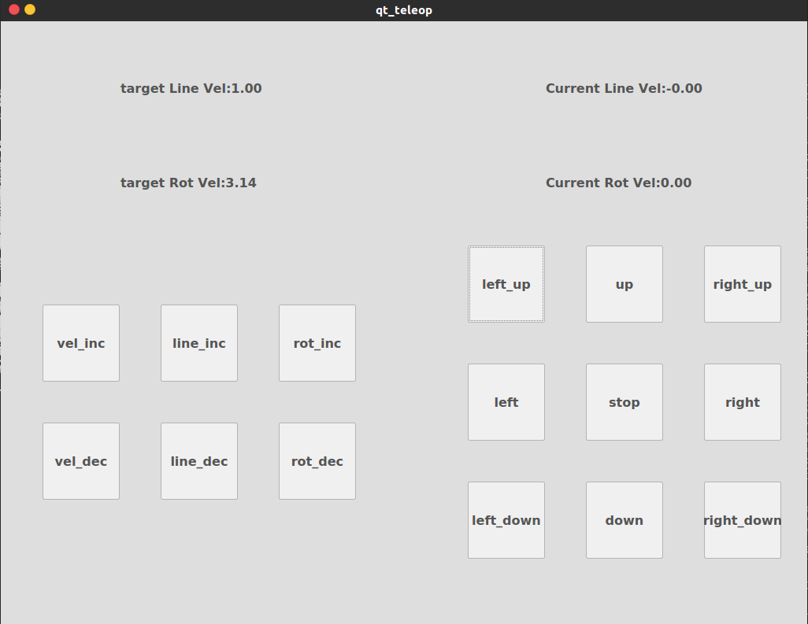

# qt_teleop使用说明  
1. qt_teleop是wangbx_robot_apps下的一个组件，是teleop的qt版本，旨在为触控屏提供一个简洁的交互环境。  
2. 不擅长UI!不擅长UI!不擅长UI!  
3. 直接使用如下指令即可开启qt_teleop，其基本界面如下图:
> roslaunch wangbx_robot_config qt_teleop.launch  
  
4. 参数说明:参数均位于launch中，其中，
> line_min为线速度最小值  
> line_max为线速度最大值  
> rot_max为角速度最大值  
> rost_min为角速度最小值  
> line_gain线速度加减速增益  
> rot_gain角速度加减速增益  